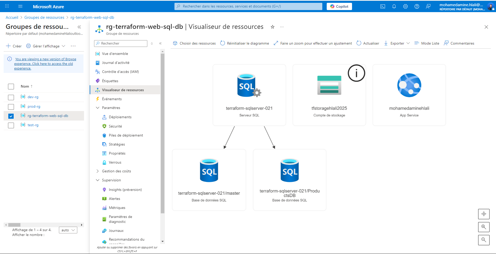
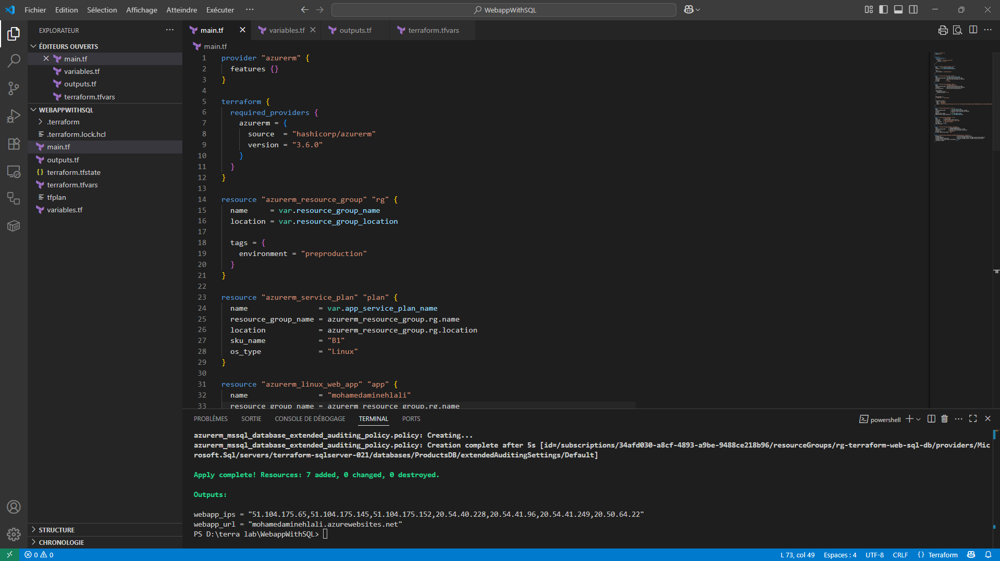

# 🌐 Azure Web App with SQL Database — Provisioned via Terraform

> An end-to-end infrastructure deployment using **Terraform** to build a fully managed **Linux Web Application** connected to an **Azure SQL Database**, including auditing and cloud-native storage.

---

## 📸 Project Overview

<!-- Add two screenshots here: 
1. Azure Resource Group Diagram (from Azure Portal)
2. Resource deployment status or App screenshot 
-->

<p align="center">
  
</p>

<p align="center">
  
</p>

---

## 🚀 What This Project Does

This Terraform project automates the deployment of a modern web application infrastructure on **Microsoft Azure**, featuring:

- ✅ A **Resource Group** to group all resources logically.
- ✅ A **Linux-based App Service** using an App Service Plan (`B1` tier).
- ✅ A **.NET 6.0 Web App** hosted in the cloud.
- ✅ A **SQL Server** and a dedicated **SQL Database** for application data.
- ✅ A **Storage Account** to store logs and enable **auditing**.
- ✅ **Connection strings** and **App Settings** dynamically injected via Terraform.
- ✅ **Auditing Policy** enabled on the database for compliance and traceability.

---

## 🧱 Architecture

```
User ---> Web App (App Service)
                 |
                 v
          Azure SQL Database
                 |
                 v
         Azure Storage (Auditing)
```

All of this is created and managed via Terraform code, making the infrastructure reproducible and scalable.

---

## 📁 File Structure

```bash
WebappWithSQL/
├── main.tf                # Main infrastructure definition
├── variables.tf           # Input variable definitions
├── terraform.tfvars       # Sensitive values (excluded from Git)
├── outputs.tf             # Optional outputs
├── .gitignore             # Excludes sensitive/generated files
└── README.md              # Project documentation
```

---

## 🛠️ Technologies Used

- **Terraform** v1.x
- **Azure Resource Manager (ARM)**
- **Azure App Service (Linux)**
- **Azure SQL Server & Database**
- **Azure Storage Account**
- **.NET 6.0 stack**
- Git & GitHub for version control

<p align="center">
  
</p>

---

## ⚙️ How to Use

### 1. Clone the Repository

```bash
git clone https://github.com/HlaliMedAmine/WebappWithSQL
cd webapp-with-sql-terraform
```

### 2. Initialize Terraform

```bash
terraform init
```

### 3. Preview the Changes

```bash
terraform plan -out=tfplan
```

### 4. Apply the Infrastructure

```bash
terraform apply tfplan
```

> **Note:** Define sensitive variables (like passwords) in `terraform.tfvars` — excluded via `.gitignore`

---

## 🛡️ Security & Best Practices

- Secrets such as passwords and connection strings are **never hardcoded**.
- All `.tfstate` and `terraform.tfvars` files are **ignored** via `.gitignore`.
- Resources are grouped logically under a **Resource Group** for easier management.
- **Auditing** is enabled for database compliance.
- Code is modular and production-ready with future CI/CD integrations in mind.

---

## 🤝 Author & DevOps Journey

Hlali Mohamed Amine
This project is part of my DevOps portfolio — showcasing hands-on expertise in:

- Infrastructure as Code (IaC)
- Azure cloud automation
- Secure provisioning and configuration
- Resource dependency management
- Scalability and maintainability using Terraform

> Project by **Hlali Mohamed Amine**  
> Connect with me on [LinkedIn](https://www.linkedin.com/in/mohamed-amine-hlali/) — Let's build modern cloud solutions together ☁️🚀

---

## 📌 License

This project is licensed under the MIT License. Feel free to fork and modify.
